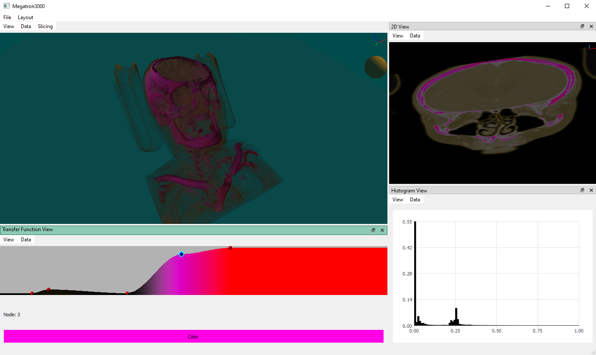

<h1>Megatron 3000</h1>

[](https://github.com/andesyv/megatron3000/actions/workflows/build.yml)

**Megatron 3000** is a volume renderer for visualization of medical CT scan data. This project was the
course project for the [INF252 - Visualization course at the University of Bergen](https://vis.uib.no/courses/inf252/).

# Table of Contents
- [Table of Contents](#table-of-contents)
- [Design](#design)
- [Overview](#overview)
  - [Transfer Function View](#transfer-function-view)
  - [2D View](#2d-view)
  - [3D View](#3d-view)
  - [Histogram View](#histogram-view)
  - [Other stuff](#other-stuff)
    - [Multithreading](#multithreading)
- [Shortcuts](#shortcuts)
  - [Global shortcuts](#global-shortcuts)
  - [View shortcuts](#view-shortcuts)
    - [3D View](#3d-view-1)
- [Dependencies](#dependencies)
- [Development setup](#development-setup)
  - [QMake](#qmake)
  - [CMake](#cmake)
    - [Visual Studio](#visual-studio)
    - [Visual Studio Code](#visual-studio-code)
- [Deployment](#deployment)
  - [Windows](#windows)
    - [VS Code](#vs-code)
- [Licence](#licence)

# Design
The project was designed using the [Five Design Sheet](http://fds.design) methodology. The final sheet (5) is supplied in the [design.pdf](design.pdf) file.
# Overview


**Megatron3000** features different tools to view and manipulate volumetric data. The program is focused around the use of smaller windows called *Views*. The program features 4 different views that can be moved around, popped out into a separate windows, rearranged, added and closed. All views can manipulate
/ display the same volumetric data, or can individually be linked against other data. Views displaying
/ modifying the same data are linked such that changes in representation are reflected in other views.

## Transfer Function View
The *transfer function view* represents a visual representation of the underlying transfer function
of the volume. A transfer function describes how the different densities of the volume is displayed.
In the representation, the horizontal axis represents the different densities and the vertical axis
represents the rendered opacity of the corresponding density. The color of the transfer function is
decided by the spherical *nodes*, which is both visualized in the 2D and the 3D view.

You can double click in the view to add nodes, which are connected by splines to create the transfer 
function. Nodes can be selected by leftclicking on them. A selected node can have its color changed 
by clicking the **color** property and selecting a color with the pop-up GUI. The color of the node
is displayed in the transfer function view, and reflected in the generated transfer function. Nodes
can be removed by right clicking them.

## 2D View
The *2D View* display slices of the data in grayscale, faithfull to how the data was originally
represented, where a solid color is the highest density and no color is the lowest density. The
representation of the view can be modified by the transfer function view however, unlike the 3D view,
the representation is unaffected by the opacity of the transfer function.

The 2D view can show slices across any of the major axis (x, y and z), any arbitrary axis, or an axis
aligned with the slicing plane in the 3D view. The current axis can be changed in the view's ***View***
menu. When aligned with the major axis, movement is limited to that axis. When aligned with the slicing
plane axis, movements in the 2D view will be reflected on the slicing plane. This makes adjusting the
slicing plane via the 2D view most likely the preferred method of moving the slicing plane.

## 3D View
The *3D View* displays a volumetric rendering of the volume, implemented using raymarching. The visual
representation of the rendering is heavily affected by the *transfer function view*.

The 3D View has an optional slicing plane that can enabled to "cut" the volume in half. This can be
useful for displaying the inner parts of the volume. The slicing plane can be enabled and disabled under
the ***Slicing*** menu. To rotate and move the slicing plane, the slicing plane can be linked and
unlinked to the camera such that movements to the camera will move be reflected on the slicing plane.
You can also move the slicing plane by using the slicing plane in a *2D View*.

There's a small ball glyph right below the axis glyph that can be used dragged with left click in order to
change the light direction of the rendering.

Shortcuts for 3D View:
 - <kbd>S</kbd> Enable / disable slicing plane
 - <kbd>L</kbd>/<kbd>Right Mouse Button</kbd> Enable / disable linked camera for slicing plane

## Histogram View
The *Histogram View* generates a histogram of the data. The histogram displays the count of the
different densities in the volume, where the horizontal axis represents the different density
*"bins"*, and the vertical axis shows the relative amount in relation to the whole volume.

The *bin count*, which is the count of different values you would like to measure, can be changed from
the ***View*** menu. In the same menu you can also map the histogram to the transfer function, which
will multiply the histogram by the transfer function. This is usefull to filter the histogram such that
the representation corresponds to the histogram.

The histogram is generated in the background using separate worker threads and will reflect any changes
in the connected data. If the histogram is mapped to the transfer function, any changes in the transfer
function will regenerate the histogram. Any changes to the bin count will also regenerate the histogram.

## Other stuff
### Multithreading
All expensive tasks the program has to do are running on separate threads from the main program,
making it possible to still use the program while stuff happens in the background. In practice this
means data loading and histogram generation. The worker threads are also cancellable.
For data loading this means that if the user decides to load a different volume mid-loading or cancel
the loading process, they can just click on another file or cancel the data window, respectively. For
histograms this means that if the user changes the data mid histogram-generation, the generation will
cancel and start a new generation as soon as it's convenient.
# Shortcuts
The application has two sets of shortcuts: *Global shortcuts* and *view shortcuts*. Global shortcuts
operate on the whole program, while view shortcuts affect the currently *focused* view. The view in
focus is indicated by having a cyanish title bar.

## Global shortcuts
 - <kbd>Tab</kbd> Cycles the view focus. You can also left click in a view to change the focus to that view.
 - <kbd>Ctrl+O</kbd> Opens a pop-up menu for loading a volume.
 - <kbd>Ctrl+Shift+O</kbd> Opens the last opened volume.
   - When you load a volume the application will create a file called `lastopened`, which will
   contain a path to the file last opened. <kbd>Ctrl+Shift+O</kbd> loads the volume from this
   file, and reverts to normal file opening if the file isn't found.
 - <kbd>Ctrl+1</kbd> Create a new *2D View*
 - <kbd>Ctrl+2</kbd> Create a new *3D View*
 - <kbd>Ctrl+3</kbd> Create a new *Tranfer Function View*
 - <kbd>Ctrl+4</kbd> Create a new *Histogram View*
 - <kbd>F5</kbd> Reload shaders (***only enabled when using a debug build***)

## View shortcuts
 - <kbd>Ctrl+W</kbd> Close the current view.

### 3D View
 - <kbd>S</kbd> Enable / disable slicing plane
 - <kbd>L</kbd>/<kbd>Right Mouse Button</kbd> Enable / disable linked camera for slicing plane

# Dependencies
The project mostly uses Qt 5.15.2, which is not supplied in this repository and must be downloaded and
installed separately for development setup. The project also uses [pulzed/mINI](https://github.com/pulzed/mINI)
to load INI files, which is supplied as a git submodule. To load all submodules you can use the following command:
```
git submodule update --init --recursive
```

# Development setup
The project uses two build systems that you can choose from when building: QMake and CMake.

## QMake
Definitively the easiest setup. Using either a Qt extension or Qt creator itself, configure the project using the [megatron3000.pro](megatron3000.pro) file.

## CMake
The project is additionaly setup using CMake as an optional approach. The CMake project setup has some dependencies in terms of externally linked libraries, which you will have to manually provide the environment paths to yourself. With CMake, this boils down to supplying the path to the CMake project of the dependency to the *CMAKE_PREFIX_PATH* variable. You can either set this as an environment variable in your working environment or you can manually set the CMake variable for the project. Here is how to do this for some different environment setups:

### Visual Studio
There are two ways of setting up a development environment in Visual Studio: using the CMake CLI or using the build-in CMake support in Visual Studio, the latter being the easiest.

**CLI**:

Using the CLI you can generate a solution file using something like this:
```
cmake -G "Visual Studio 16 2019" -DCMAKE_PREFIX_PATH="D:\Qt\5.15.2\msvc2019_64"
```
Replace `Visual Studio 16 2019` with whatever version of Visual Studio you're using, and replace `D:\Qt\5.15.2\msvc2019_64` with the path to your Qt installation (for a specific Qt version and compiler combo). Building the solution as normal in Visual Studio will then build the project, but you will have to manually set up a debugging target and deployment on your own.

**CMake Extension**:

Visual Studio 2017 and later has build-in support for CMake. To use this you open up the editor, go to File -> Open -> CMake and then navigate to and select the root `CMakeLists.txt` in this project.

A sample [CMakeSettings.json](CMakeSettings.json) file is included in the project. The CMake extension uses this to correctly configure the CMake project for Visual Studio. In this file you will need to specify additional paths to any dependencies required by the project, like Qt. Just change the `cmakeCommandArgs` key to `"-DCMAKE_PREFIX_PATH=\"qt-installation-path"` where *qt-installation-path* is the full path to your Qt installation.

### Visual Studio Code
If you're using the [CMake extension for visual studio code](https://marketplace.visualstudio.com/items?itemName=twxs.cmake) you can add custom settings to cmake for a particular workspace by adding it to the `.vscode/settings.json` file. Simply add the key `cmake.configureEnvironment` with the property `CMAKE_PREFIX_PATH` followed by the path to your Qt installation to the `.vscode/settings.json` file (create it if it doesn't exist). Example `.vscode/settings.json` file:
```json
{
    "cmake.configureEnvironment": {
        "CMAKE_PREFIX_PATH": "D:\\Qt\\5.15.2\\msvc2019_64"
    }
}
```

For linter help you would probably also like to add the include path `<qt-installation-path>/include` to the `.vscode/c_cpp_properties.json` file aswell. Ex.:
```json
{
    "configurations": [
        {
            "name": "Win32",
            "includePath": [
                "${workspaceFolder}/**",
                "D:\\Qt\\5.15.2\\msvc2019_64\\include"
            ]
        }
    ]
}
```

# Deployment
## Windows
If using Windows you need to dynamically link to shared libraries. To do this you need to have all the dynamically linked libraries loaded in a path the executable have access to, like the working directory or system32. Fortunately Qt comes with a program to setup dynamically linked libraries for us called `windeployqt`. Simply run this program, located in the `bin` folder for your Qt installation, with the built executable as an argument and it will set up all shared libraries in the current working directory.

### VS Code
VS Code tasks are handy, so I've set up a tasks template in the file [vscode.tasks.json](vscode.tasks.json) that can be used to automate the process of building and linking.

# Licence
Copyright © 2021, Sigurd Aleksander Sagstad and Anders Syvertsen.